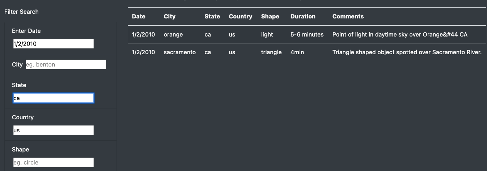

# UFO Sighting Website

## Overview of Project
### Purpose
The purpose of this analysis was to create a webpage with a filterable table to store all the data for UFO sightings.

## Results
 
The filter criteria is quite simple to use. If the user would like to narrow the UFO sightings down for to a specific date, city, state, country, or shape all they have to do is type the value into the corresponding filter search box. Additionally, the filters can be strung together so if a user wanted to see UFO sightings that were on 1/2/2010 in California they could put those values in the correct search filters to see that data (see example below). 

## Summary
### Drawbacks
- One drawback of this set up is that users can only put one filter item in each element. For example if they wanted to see the data for all sightings in Washington, Oregon, and California, they would need to do three seperate searches.

### Possible Enhancements
- There is no way to sort the data after filtering. I would recommend creating features that would allow the user to sort ascending and descending.
- There is no way to filter for multipe results in one element (e.g. searching for triangle or circle shapes). I would recommend adjusting the code to allow multiple inputs for each element.
- There are not visualizations, making it difficult for the user analyze the data. I would recommend providing some visualizations (graphs and charts).
- There is no way to search comments or duration.
- The filter values must match the table values exactly.
